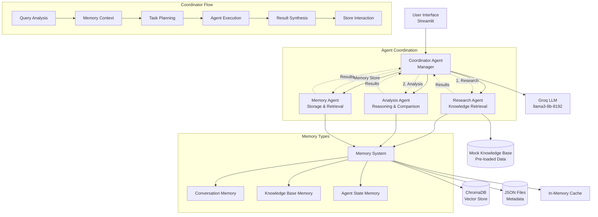

# multi-agent-system

## Architecture Diagram

```mermaid
graph TD
    U[User Interface<br/>Streamlit] --> C[Coordinator Agent<br/>Manager]

    C --> RA[Research Agent<br/>Knowledge Retrieval]
    C --> AA[Analysis Agent<br/>Reasoning & Comparison]
    C --> MA[Memory Agent<br/>Storage & Retrieval]

    RA --> MS[Memory System]
    AA --> MS
    MA --> MS

    MS --> VDB[(ChromaDB<br/>Vector Store)]
    MS --> JSON[(JSON Files<br/>Metadata)]
    MS --> CACHE[In-Memory Cache]

    C --> LLM[Groq LLM<br/>llama3-8b-8192]
    RA --> KB[(Mock Knowledge Base<br/>Pre-loaded Data)]

    subgraph "Coordinator Flow"
        C1[Query Analysis] --> C2[Memory Context]
        C2 --> C3[Task Planning]
        C3 --> C4[Agent Execution]
        C4 --> C5[Result Synthesis]
        C5 --> C6[Store Interaction]
    end

    subgraph "Memory Types"
        MS --> CM[Conversation Memory]
        MS --> KM[Knowledge Base Memory]
        MS --> SM[Agent State Memory]
    end

    subgraph "Agent Coordination"
        C -.->|1. Research| RA
        C -.->|2. Analysis| AA
        C -.->|3. Memory Store| MA
        RA -.->|Results| C
        AA -.->|Results| C
        MA -.->|Results| C
    end
```
